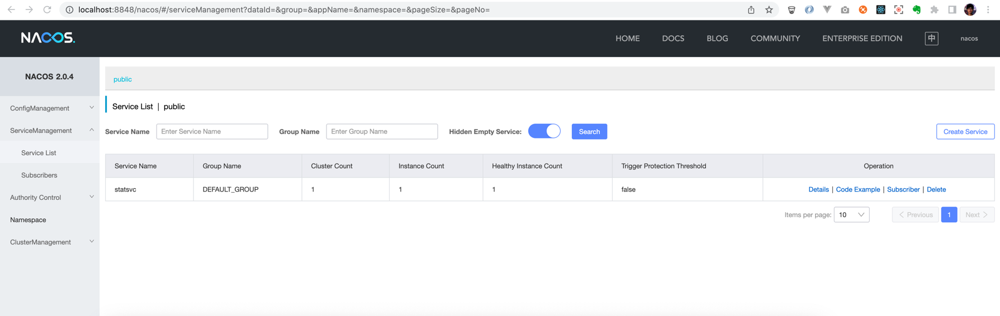
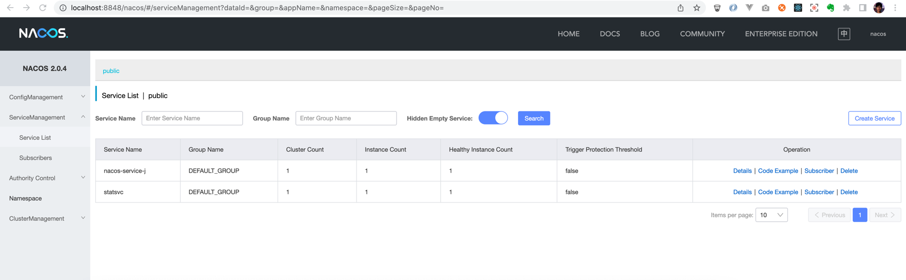

# nacos

EN [中文](./README_zh.md)

This project is a demo project for demonstrating how to use Nacos for service discovery 
in go-doudou RESTful service application. It also shows how to call each other between 
go-doudou service and spring cloud service.

## Prerequisite

- Docker for Desktop
- Modern Browser
- CLI tool
- IDE, recommend goland
- Http request tool, recommend [httpie](https://github.com/httpie/httpie)

## Steps

1. Start Nacos server in standalone mode
```shell
docker-compose -f docker-compose.yml up -d
```

```shell 
➜  nacos git:(master) ✗ docker ps                                                  
CONTAINER ID   IMAGE                       COMMAND                  CREATED          STATUS                    PORTS                                                                                  NAMES
2e5400f6d085   nacos/nacos-server:v2.0.4   "bin/docker-startup.…"   18 minutes ago   Up 18 minutes (healthy)   0.0.0.0:8848->8848/tcp, :::8848->8848/tcp, 0.0.0.0:9848->9848/tcp, :::9848->9848/tcp   nacos-standalone
```

2. Change to `statsvc` directory, run below command to start go-doudou service
```shell
go mod tidy && go run cmd/main.go
```

If you see below output log, the service has started successfully
```shell               
 _____                     _                    _
|  __ \                   | |                  | |
| |  \/  ___   ______   __| |  ___   _   _   __| |  ___   _   _
| | __  / _ \ |______| / _` | / _ \ | | | | / _` | / _ \ | | | |
| |_\ \| (_) |        | (_| || (_) || |_| || (_| || (_) || |_| |
 \____/ \___/          \__,_| \___/  \__,_| \__,_| \___/  \__,_|
INFO[2022-03-12 13:24:31] ================ Registered Routes ================ 
INFO[2022-03-12 13:24:31] +-------------+--------+-------------------------+ 
INFO[2022-03-12 13:24:31] |    NAME     | METHOD |         PATTERN         | 
INFO[2022-03-12 13:24:31] +-------------+--------+-------------------------+ 
INFO[2022-03-12 13:24:31] | Add         | POST   | /api/add                | 
INFO[2022-03-12 13:24:31] | Echo        | GET    | /api/echo               | 
INFO[2022-03-12 13:24:31] | GetDoc      | GET    | /go-doudou/doc          | 
INFO[2022-03-12 13:24:31] | GetOpenAPI  | GET    | /go-doudou/openapi.json | 
INFO[2022-03-12 13:24:31] | Prometheus  | GET    | /go-doudou/prometheus   | 
INFO[2022-03-12 13:24:31] | GetRegistry | GET    | /go-doudou/registry     | 
INFO[2022-03-12 13:24:31] | GetConfig   | GET    | /go-doudou/config       | 
INFO[2022-03-12 13:24:31] +-------------+--------+-------------------------+ 
INFO[2022-03-12 13:24:31] =================================================== 
INFO[2022-03-12 13:24:31] Started in 564.738µs                         
INFO[2022-03-12 13:24:31] Http server is listening on :6060 
```

Now, you can open browser and navigate to http://localhost:8848/nacos, login and click `/ServiceManagement/Service List`
in sidebar menu, then you can see `statsvc` service has been registered to Nacos server.



3. Change to `nacos-service-j` directory, run below command to start spring cloud service
```shell
mvn spring-boot:run
```

If you see below output log, the service has started successfully
```shell
2022-03-12 13:32:41.630  INFO 88684 --- [t.remote.worker] com.alibaba.nacos.common.remote.client   : [f1bf3cba-e469-43c7-a8b8-83457ee4c153] Notify connected event to listeners.
2022-03-12 13:32:41.706  INFO 88684 --- [           main] o.s.b.w.embedded.tomcat.TomcatWebServer  : Tomcat started on port(s): 8080 (http) with context path '/nacos-service-j'
2022-03-12 13:32:41.723  INFO 88684 --- [           main] c.a.c.n.registry.NacosServiceRegistry    : nacos registry, DEFAULT_GROUP nacos-service-j 192.168.43.200:8080 register finished
2022-03-12 13:32:41.727  INFO 88684 --- [           main] c.u.n.NacosServiceJApplication           : Started NacosServiceJApplication in 2.751 seconds (JVM running for 3.059)
```

Now, if you refresh `/ServiceManagement/Service List` page, you can see `nacos-service-j` service has been registered to Nacos server.



4. Test `statsvc` service
```shell
➜  nacos git:(master) ✗ http http://localhost:6060/api/echo\?s\=go-doudou
HTTP/1.1 200 OK
Content-Encoding: gzip
Content-Length: 67
Content-Type: application/json; charset=UTF-8
Date: Sat, 12 Mar 2022 05:37:43 GMT
Vary: Accept-Encoding

{
    "data": "Hello Nacos Discovery go-doudou"
}


```

5. Test `nacos-service-j` service
```shell 
➜  nacos git:(master) ✗ http http://localhost:8080/nacos-service-j/add\?x\=50\&y\=20                                            
HTTP/1.1 200 
Connection: keep-alive
Content-Type: application/json
Date: Sat, 12 Mar 2022 05:38:38 GMT
Keep-Alive: timeout=60
Transfer-Encoding: chunked

{
    "data": 70
}


```