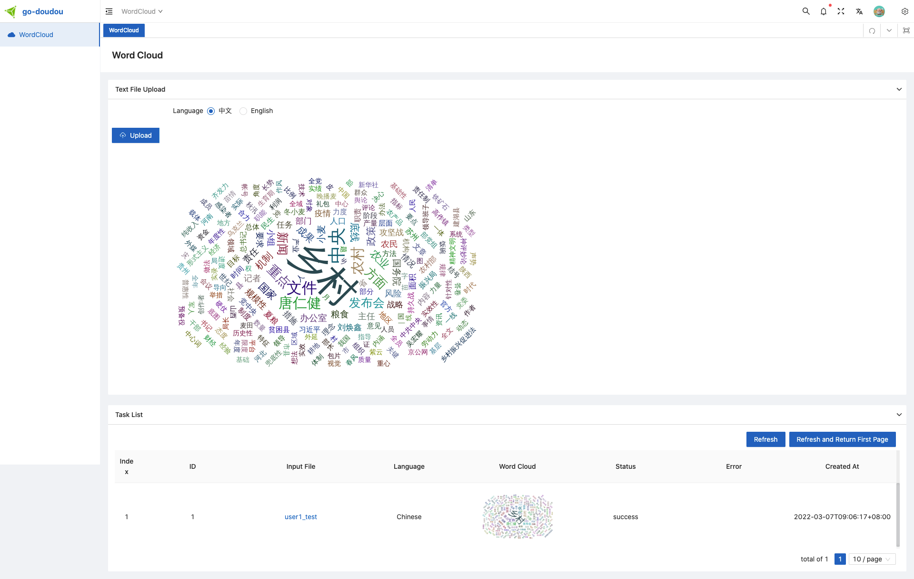
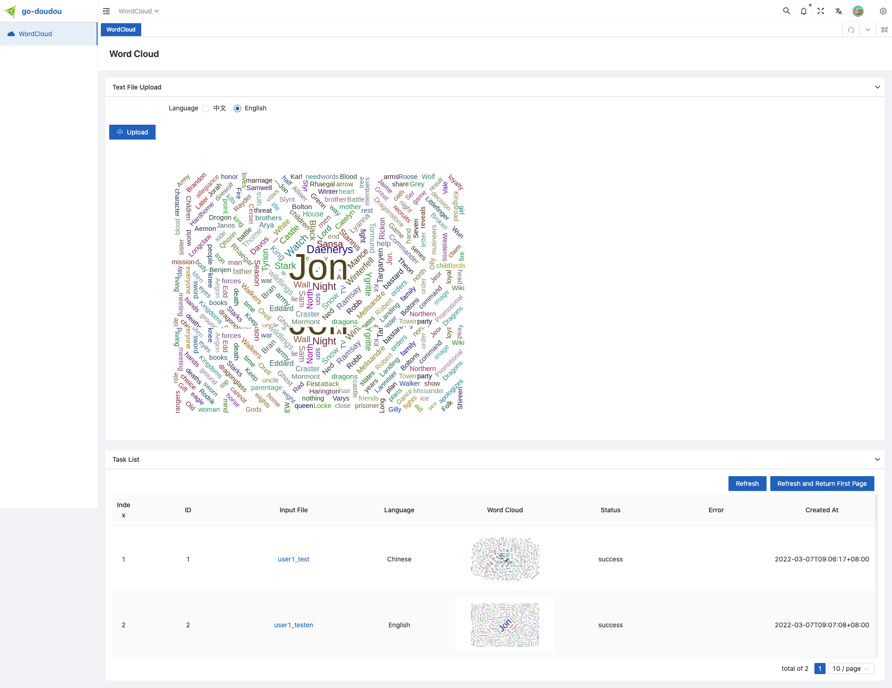

# wordcloud

## Step0

- `cd wordcloud-bff && docker build -t wordcloud_wordcloudbff .`
- `cd wordcloud-maker && docker build -t wordcloud_wordcloudmaker .`
- `cd wordcloud-seg && docker build -t wordcloud_wordcloudseg .`
- `cd wordcloud-task && docker build -t wordcloud_wordcloudtask .`
- `cd wordcloud-user && docker build -t wordcloud_usersvc .`
- `cd wordcloud-ui && docker build -t wordcloud-ui .`

## Step1

`docker-compose -f docker-compose.yml up -d`

## Step2

Open Chrome or firefox browser and navigate to `http://localhost:3100/`.

- Username: jackchen
- Password: 1234

## Screenshot

